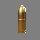

# Game Design Document

----

## Escape from Monster Castle
Monster Castle: Quest for Gold is a game in which the user's goal is to collect as many pots of gold 
and pieces of candy as possible. The catch is the user must dodge monsters, which cost the user one life,
and dynamite, which--if run into or near to when it explodes--will cause the game to end, regardless of how many lives are left. The 
goal of the game is to collect the most amount of points before the user's lives run out or the game is 
terminated by running into dynamite.

### General Gameplay
To begin the game, the user will always start in the bottom center of the board. The player's main goal is 
to collect the pots of gold, worth five hundred points.The user loses a life if he runs into any
monsters, which will be moving randomly.

The user maneuvers himself using the left and right buttons. The user can also 
collect a piece of candy, which replenishes his health in that it gives him one life. Once collected, the piece of
candy (and the pot of gold) will disappear and reappear at a random other location to be collected again in 
the future if the user desires. If the user runs into the dynamite, which will move vertically, the
game will automatically end and the user will end up with however many points he or she has collected thus far. The dynamite
also explodes as soon as it reaches the bottom of the screen, so anything near it will either disappear, or in the case
of the player, lose all lives.

The user will have three lives to start with. Gameplay only ends when the user loses his last life or runs
into the dynamite. If the user loses a life, he will be reset at the center starting position. The goal is to get 
the most amount of points by the end of the game, which can be done by collecting pots of gold. 
The game will speed up as gameplay goes on, until it becomes virtually impossible to play.

###Objects
**The following is a list of all objects in the game:**

  1. User [not counted as one of the five objects]: can be moved using left and right buttons. Will be represented by the following image (which will be shrinked to fit game board scale):
  
  
  2. Monster [Object 1 of 5]: When this monster appears, it will start to randomly **move** back and forth. If the user runs into the monster, the user
      will lose a life. If the user shoots the monster, he gains 300 points. This monster will be represented by the following image:

    
  4. Pot of Gold [Object 2 of 5]: The pot of gold will appear and move vertically down the screen. Every time the user passes
     over it, 500 points will be added to the user's score. This object will be represented by the following image, which will
     obviously be resized to fit the game board scale:

     
  5. Candy [Object 3 of 5]: The candy will randomly appear and **move** vertically down the board. If the user runs into
     it, the user will gain one life. The candy will disappear when it is collected and reappear elsewhere later. 
     The candy will be represented by this icon:

     
  6. Bullet [Object 4 of 5]: If the user clicks the "Shoot" pushbutton, he will shoot a bullet vertically up the 
  screen. If he hits a monster with the bullet, that monster will die and the user will gain 300 points. The bullet will be
    represented by the following icon: 
    
    

  7. Dynamite [Object 5 of 5]: This object will appear and **move** downward. If the user runs into it, the game will
     immediately end, regardless of how many lives the user has left. Also, the dynamite will explode when it reaches the
     bottom of the screen, destroying anything near it and causing the user to lose a life. 
     The user will receive the score they have at the
     moment they ran into the dynamite. This should not happen too often because the dynamite will be the slowest moving and least
     frequent
     object. The dynamite will be represented by the following image:
     
     
     
###Graphical User Interface
The following will show how the game will look at different stages: 

  1. On the opening screen, the user will be able to enter his or her name and then press `Start` (the `Start` button can only
     be pressed if the user has entered something in the text box. The user alternatively has the option to click a push 
     button called `How to Play` that creates a pop up window detailing how to play the game (see number 2). The 
     image below illustrates this layout:
     
     
     
  2. Pop-up window showing how to play the game:
  
     
     
  3. After the user has pressed `Start`, a new scene will appear. On the top strip will be a `Pause` button on 
     the far left and a `Restart` button on the far right that can be pushed at any time. In between these will be the user's score, followed by
     the number of lives he has left. Below that will be the actual game play. Finally, the bottom strip will have a `Quit`
     button and the user's name. This is shown below:
     
      
  
  4. When the game ends, the user will be taken to a new screen that says Game Over at the top. Below that, it will show the
     user's name, and below that will be the word Score: followed by the user's score. Below all of that will be a button that
     says `Play again?` which will restart the game. This is shown here:
     
      
     

